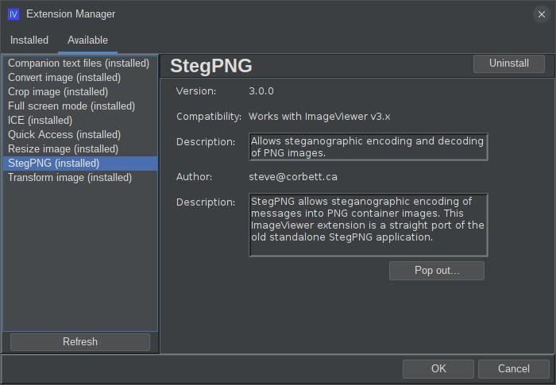
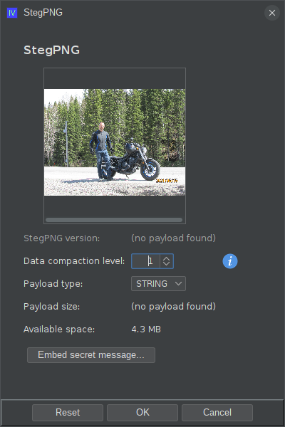
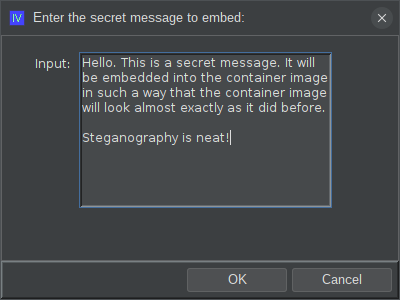
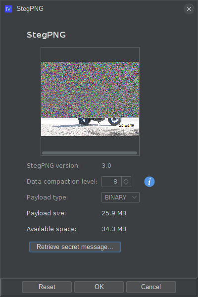
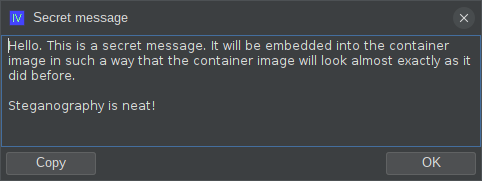

# ext-iv-stegpng

## What is this?

StegPNG is an extension for ImageViewer that allows you to steganographically embed messages into a PNG container
image, without it being visually obvious that the PNG image has been modified. This is a port of a very old
standalone Java application that I wrote way back in 2004. I thought it might be neat to dust off this
old code and repackage it as an application extension for my [ImageViewer](https://github.com/scorbo2/imageviewer)
application.

## "Steganography? Is that like cryptography?"

No! Cryptography uses a key or a password to scramble a message so that it cannot be read without the correct key.
Steganography, on the other hand, is the practice of hiding a message in plain sight. The message is not encrypted,
but rather hidden within another file (in this case, a PNG image) so that it is not obvious that the message even
exists. For a very simple example of steganography, consider the following text message:

```
My every effort to attack...
the monster is Dracula, not Igor!
God help them! 
```

Bad poetry, perhaps? But wait... let's look at the first letter of each word:

```
Meet at miDnIGht
```

We see that a secret message was hidden inside the harmless-looking container message. The message does not
require a "key" or a "password", but rather an understanding of how it was embedded into the container.
The container message can be passed around freely, but its true meaning will only be understood by
those who know how to extract the hidden message. This is the essence of steganography.

It turns out that we can do something very similar with certain lossless image formats, like PNG.
By modifying the least significant bits of the pixel data, we can embed a message into a PNG image without
visually altering the image. The message can be extracted later by someone who knows how it was embedded.

### "But why not jpeg?"

The JPEG format is a "lossy" compression format, which means that the pixel data of the image may not
be saved to disk exactly as it was in memory. This is great for space-saving on disk, but it unfortunately
impairs our ability to make surgical changes to the pixel data of the image. The PNG format saves pixel data
to disk in a "lossless" format, faithfully preserving every bit of every pixel. For this reason,
StegPNG only supports the PNG format.

## "Okay, how do I get it?"

### Option 1: automatic download and install

The easiest way to get this extension is to use the ExtensionManager dialog within the ImageViewer application
to install it automatically. To do this, open the ExtensionManager dialog from the "Settings" menu, and
go to the "Available" tab. You should see "StegPNG" in the list of available extensions:



### Option 2: manual download and install

You can manually download the extension jar:
[ext-iv-stegpng-3.0.0.jar](http://www.corbett.ca/apps/ImageViewer/extensions/3.0/ext-iv-stegpng-3.0.0.jar)

Save it to your ~/.ImageViewer/extensions directory and restart the application.

### Option 3: build from source

You can clone this repo and build the extension jar with Maven (Java 17 or higher required).
Note: you must already have run `mvn install` in the main ImageViewer repo, as that is a dependency for this code.

```shell
git clone https://github.com/scorbo2/ext-iv-stegpng.git
cd ext-iv-stegpng
mvn package

# Copy the result to extensions directory:
cp target/ext-iv-stegpng-3.0.0.jar ~/.ImageViewer/extensions
```

## Okay, it's installed, now how do I use it?

Browse to any PNG image and hit `Ctrl+Alt+S`, or select "StegPNG" from the "Edit" menu. This will bring
up the StegPNG dialog:



You see a small preview of the selected image, and a few options for embedding or extracting messages.

### Embedding a message

If the selected image does not already contain a hidden message, you have the following options:

- **Data compaction level**: This is a number from 1 to 8 that controls how many bits per byte of each pixel we will
  "steal" for embedding the secret message. Lower values will have less visual effect on the container image, but the
  storage space will be more limited. Higher values allow you to embed a larger secret message, but the results will be
  more visually obvious. A compaction level of 8 will completely destroy the pixels of the container image, resulting in
  an image that appears corrupt. A value of 1 is the safest option, as the visual effect will be extremely small. As you
  change the compaction level, the "available storage" value will update to show you how much data you can embed with
  the current settings.
- **Payload type** - you can choose between STRING and BINARY: STRING allows you to type a simple text message, while
  BINARY will prompt you to select a file on disk to embed as the secret message. In either case, you will receive an
  error if the message to be embedded is larger than the available space within the container image.
- **Embed secret message** - when you are ready, click this button. You will be prompted depending on the desired
  payload type. For example, if you select STRING, you will see a text input dialog:



#### Going too far - an extreme example

Data compaction level 8 is only included to show what happens when you apply the algorithm too aggressively.
Here's an example of what happens when you try to embed a message with compaction level 8:



A message of size 27MB was embedded into an image that had 34MB of available space. Notice that the top three quarters
or so of the image data has been completely destroyed, and only the bottom portion is still intact. This is because
the algorithm starts embedding at the top left of the image, and works slowly across each row, and down vertically
from the top of the image towards the bottom. With data compaction level 8, it utterly destroys whatever image
data was there before. It is now obvious that the image has been modified, and so we have defeated the purpose
of the application. This is why compaction level 1 or 2 would be recommended for most use cases.

### Retrieving a message

On the other hand, if the selected image already contains a hidden message, then the data compaction and payload type
controls will be disabled, and you will be presented with a read-only summary. The only option is "retrieve secret
message". If the payload type is STRING, you will be shown the hidden message in a popup:



If the payload type is BINARY, you will see a file chooser, asking you where you wish to save the extracted message.

There is currently no way to "un-steg" an image once a message has been embedded. Note that when you click OK in this
dialog, you will be prompted to confirm that you wish to overwrite the source image with the new stegged version.
If you cancel the dialog, the source image will be left unmodified.

## Disclaimer

StegPNG was an academic project that I wrote for fun back in 2004. It is not intended for serious use - more as
a demonstration of the concept of steganography, and now as a fun little extension for ImageViewer. There is no
warranty or guarantee of applicability for any particular purpose.

## Requirements

Compatible with any ImageViewer 3.x release.

## License

ImageViewer and this extension are made available under the MIT license: https://opensource.org/license/mit

